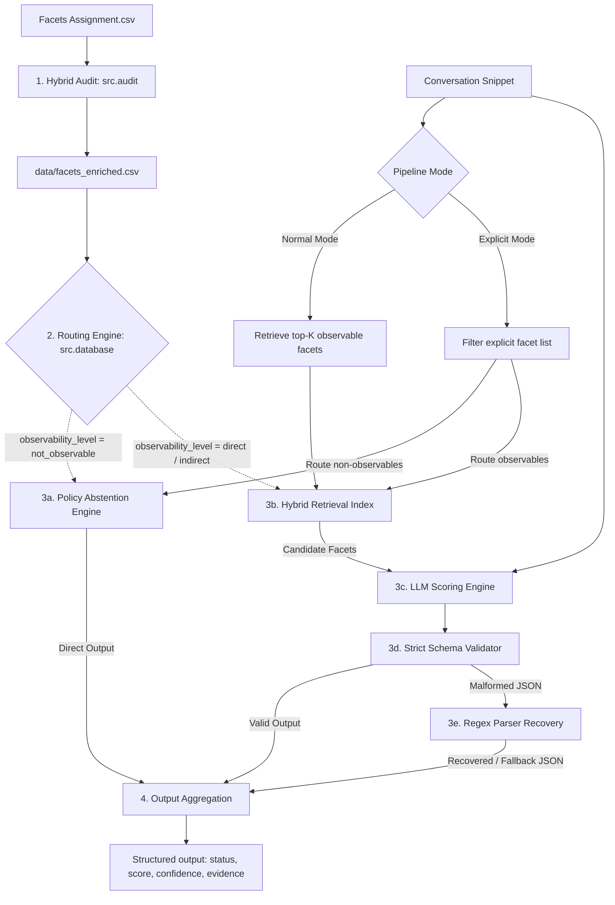

# Implementation Plan - Scalable Conversation Facet Evaluator (Finalized)

This finalized plan implements a production-minded pipeline to evaluate conversational text against a facet catalogue, incorporating all final improvements for execution modes, robust API connection parameters, clean metric separation, and aligned taxonomy examples.

---

## User Review Required

### Key Architecture Enhancements
1. **Pipeline Execution Modes:**
   * **Normal Scoring Mode (Retrieval-based):** Given a conversation snippet, the system runs hybrid retrieval over the `direct` and `indirect` observable facets, scoring only the top-$K$ candidates, while leaving all other facets untouched.
   * **Explicit Facet Evaluation Mode (Direct-routing):** Given a conversation snippet and an explicit list of target facets (used in the benchmark and direct API requests), the system routes each facet through the dual-pathway engine:
     * `direct` and `indirect` facets are passed to the Hybrid Retrieval index to verify relevance, then to the LLM for scoring.
     * `not_observable` facets bypass the LLM and are handled deterministically by the Policy Abstention Engine.
2. **Robust Hosted API Client:**
   * Uses environment variables `LLM_TIMEOUT` (default: 15s) and `LLM_MAX_RETRIES` (default: 2).
   * Implements retry logic with basic backoff. If the API fails after retries, the pipeline falls back gracefully to a local model or returns `"invalid_model_output"` rather than crashing.
3. **Clear Hallucination Taxonomy:**
   * **`Clinical depression diagnosis`** (facet) $\rightarrow$ `not_observable` (requires professional diagnosis).
   * **`Feeling energetic`** (facet) $\rightarrow$ `indirect` (observable).
   * *Snippet:* "I'm feeling tired today." $\rightarrow$ The retriever brings up `Feeling energetic`. The LLM must output `status: "insufficient_evidence"` and `score: null` (since one off-day is not enough to score a general personality/mood facet).
4. **Divided Benchmark Metrics:**
   * **Retrieval Recall@K:** Evaluated *only* on `direct` and `indirect` facets to avoid penalizing retrieval for ignoring non-observable facets.
   * **Policy Abstention Accuracy:** Evaluated on `not_observable` facets to verify that they are correctly blocked and routed to the Policy Engine.

---

## Proposed Changes



### Component 1: Hybrid Audit & Preprocessing (`src/audit.py`)
* Normalizes raw facets (strips index prefixes like `800.` and trailing colons).
* Categorizes facets into `facet_type` (e.g. `personality_trait`, `medical_physiological`, etc.).
* Determines `observability_level`: `"direct"`, `"indirect"`, or `"not_observable"`.
* Sets `rule_confidence` (`"high"` or `"medium"`) and `needs_review` (True/False) to isolate ambiguous facets for manual check.

### Component 2: Routing, Indexing & Hybrid Retrieval (`src/database.py`)
* **Taxonomy Router:** Routes `"not_observable"` facets directly to the Policy Engine.
* **Hybrid Retrieval Index:**
  * Uses `all-MiniLM-L6-v2` to compute cosine similarity for `"direct"` and `"indirect"` facets.
  * Adds simple keyword matching (e.g., matching "risk" words to the `Risktaking` facet).
  * Deduplicates and returns the top-$K$ candidate list.
* Exposes methods for both **Normal Scoring Mode** (retrieve all relevant observables) and **Explicit Facet Evaluation Mode** (route a specific list of facets).

### Component 3: LLM Scoring Engine & Strict Parser (`src/scoring.py`)
* **LLM Client:** Connects to the configured hosted LLM (or local Qwen-1.5B fallback) using environment variables `LLM_TIMEOUT` and `LLM_MAX_RETRIES`.
* **System Prompt:** Passes the conversation turn along with candidate facets. Instructs the model to output a JSON list mapping to our strict schema rules.
* **Schema Validation & Recovery:**
  * Enforces field types and value restrictions (e.g., if scored, score is 1-5; if abstained, score is `null`).
  * If validation fails, attempts regex extraction of JSON objects. If both fail, records `status: "invalid_model_output"` and `score: null` for safety.

### Component 4: Policy Abstention Engine (`src/policy.py`)
* Bypasses the LLM for `"not_observable"` facets.
* Directly creates the result record, mapping the `confidence` to match the facet's audited `rule_confidence` (either `"high"` or `"medium"`).

### Component 5: Benchmark & Dual-Metric Evaluation (`src/benchmark.py`)
* **Conversations:** 10 short snippets covering sarcasm, code-switching, contradictions, and quotes.
* **Facets:** 20 representative facets (10 observable, 10 non-observable).
* **Reporting:** Prints a metrics table showing:
  * **Retrieval Recall@K** (evaluated only on direct/indirect facets).
  * **Policy Abstention Accuracy** (evaluated on non-observable facets).
  * **Score Agreement Rate** (evaluates LLM/Policy engine scoring accuracy).
  * **Abstention Accuracy** (correct vs incorrect abstentions).
  * **Invalid Output Rate** (any output validation failures).

---

## File Structure

```text
Ahoum/
├── data/
│   ├── Facets Assignment.csv    (raw input)
│   └── facets_enriched.csv       (output of src/audit.py)
├── src/
│   ├── __init__.py
│   ├── audit.py                 (Preprocessing, taxonomy & observability classification)
│   ├── database.py              (Hybrid retriever: semantic + keyword, routing)
│   ├── policy.py                (Deterministic policy abstention engine)
│   ├── scoring.py               (LLM client, prompt generation, strict validation)
│   ├── benchmark.py             (Evaluation suite and metrics logger)
│   └── config.py                (Configurations and environment variables)
├── tests/
│   ├── test_audit.py
│   ├── test_retrieval.py
│   └── test_parser.py
├── run_pipeline.py              (Master pipeline runner)
├── requirements.txt             (pandas, sentence-transformers, huggingface_hub, etc.)
├── README.md                    (Execution guidelines, architecture, scaling notes)
├── DECISIONS.md                 (Design trade-offs: observability levels, hosted backend, hybrid retrieval)
├── DEBUGGING.md                 (Dev debugging logs)
└── PROMPT_LOG.md                (Prompt logs)
```

---

## Verification Plan

### Automated Tests (`tests/`)
1. `test_audit.py`: Verify correct categorization into `direct`, `indirect`, and `not_observable`, and check rule confidence mappings.
2. `test_retrieval.py`: Test hybrid search yields expected facets (both semantic matches and keyword matches).
3. `test_parser.py`: Verify validation of schema rules (e.g. score must be null if status is insufficient_evidence) and test regex recovery.

### Hallucination Manual Validation
Run the benchmark and verify that:
1. Complain of tiredness returns `insufficient_evidence` for indirect facets (e.g. `Feeling energetic`) and returns `not_observable` for non-observable facets (e.g. `Clinical depression diagnosis` or `FSH level`).
2. Cooking pasta returns `not_observable` for `Nationality` and `Passport-stamps count`.
3. Discussing mindfulness returns `insufficient_evidence` for `Yoga discipline hours / week`.
